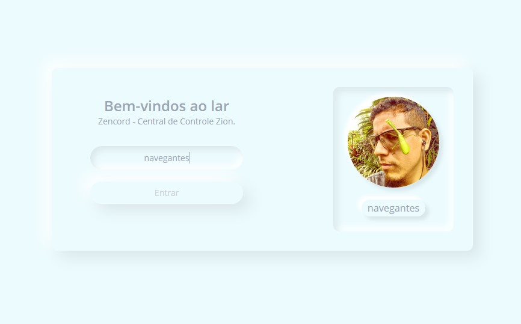
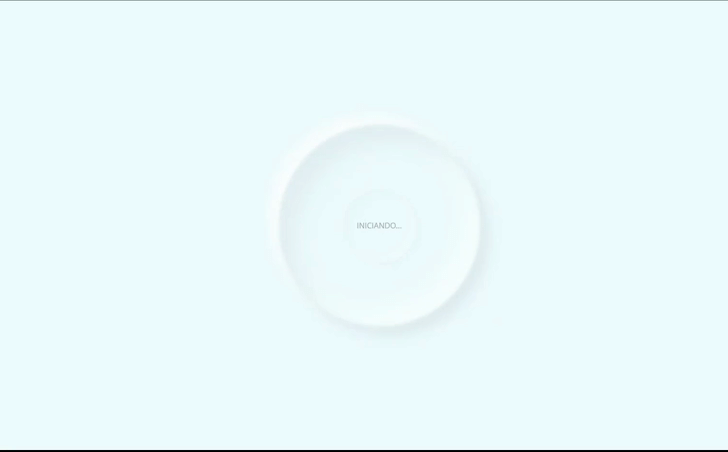

# Zioncord

## A central de controle de Zion

- Esse projeto foi desenvolvido durante a ImersãoReact da @alura com @omariosouto e @peas.
- O Zioncord é a central de controle oficial de Zion. É um hub de informação criado para conectar as pessoas de dentro e fora da Matrix.
- Seu design é minimalista, baseado no conceito de neumorfismo, para que suas interações entrem no estado de flow sem distrações.
- Link para o projeto [aqui](https://aluracord-zencord.vercel.app).
- Link para versão de desenvolvimento [aqui](https://aluracord-zencord-dev.vercel.app) utilizando Giphy API.

  
  

